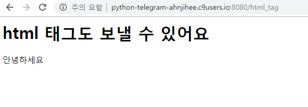

# 2019-02-26  Flask


## Flask intro

------

##### flask import와 server 실행시키기

```python
#플라스크 모듈 import
import random
from flask import Flask,render_template
app = Flask(__name__)

#server 실행 옵션    
if __name__ == '__main__':
    app.run(debug = True, host = '0.0.0.0', port = 8080)
    #debug 모드를 on으로 설정하면, 파일의 내용이 수정되면 자동으로 서버를 껐다켠다.
```


##### URL route 설정하기

```python
#url route 설정
@app.route("/")
def hello(): #함수를 정의해줘야 기능히 수행된다.
    return "Hello World!"
```


##### /multi_c로 경로 설정하기

```python
@app.route("/multi_c")
def multi():
    return "멀캠C반"
```


##### html 태그 보내기 / html 파일 불러오기

```python
@app.route("/html_tag")
def html_tag():
    return """
    <h1>html 태그도 보낼 수 있어요</h1>
    <p>안녕하세요</p>
    """
@app.route("/html_file")
def html_file():
    return render_template("html.html")
    #새로운 폴더를 templates로 만들어서 html 파일을 추가한다.
```




##### 

##### 파라메터 전달하기

```python
@app.route("/hi/<string:name>") #<date형식 : data를 담을 변수>
def hi(name):
    return render_template("hi.html", name=name)
    
@app.route("/cube/<int:num>") #인자 값을 받아올 때는 함수 안에 넣어줘야 사용 가능
def cube(num) :
    cubic_num = num ** 3 #**두개 쓰면 지수를 사용할 수 있다.
    return render_template("cube.html",num=num, cubic_num=cubic_num) #, 뒤에 원하는 변수를 html에게 전달하여 줄 수 있다.
```


##### hi.html

```html
<!DOCTYPE html>
<html lang="en">
<head>
    <meta charset="UTF-8">
    <meta name="viewport" content="width=device-width, initial-scale=1.0">
    <meta http-equiv="X-UA-Compatible" content="ie=edge">
    <title>Document</title>
</head>
<body>
    <h1>{{name}}님 안녕하세요</h1>
</body>
</html>
```

##### cube.html

```html
<!DOCTYPE html>
<html lang="en">
<head>
    <meta charset="UTF-8">
    <meta name="viewport" content="width=device-width, initial-scale=1.0">
    <meta http-equiv="X-UA-Compatible" content="ie=edge">
    <title>Document</title>
</head>
<body>
    {{num}}의 세제곱은 {{cubic_num}} 입니다.
</body>
</html>
```


##### random하게 페이지 만들기

```python
@app.route("/dinner")
def dinner():
    menu_list = ["엽떡", "뿌링클", "치즈볼"]
    pick = random.choice(menu_list) #한개의 랜덤을 뽑을 때는 choice
    return render_template("dinner.html", pick=pick)
    
@app.route("/lotto")
def lotto():
    number = range(1,46)
    pick = random.sample(number,6) # 난수를 여러개 뽑을 때는 sample
    return render_template("lotto.html", pick = pick) #python 코드를 html 에서도 사용할 수 있도록 해준다.
    
@app.route("/random_img")
def random_img():
    return render_template("random_img.html")
    
@app.route("/ego/<string:name>")
def ego(name):
    url = "http://api.giphy.com/v1/gifs/search?api_key=x4rhsV9fqHmv0bLBSbd6I9Gb7J0f0EIu&q="
    fake = Faker("ko_KR")
    job = fake.job()
    res = requests.get(url+job).json() #요청 보내기, json을 딕셔너리 형태로 바꿔준다.
    #json은 파이썬의 딕셔너리 형태와 유사하다.
    img_url = res["data"][0]["images"]["original"]["url"]
    
    return render_template("ego.html",img_url=img_url, name=name, job=job)
```

##### dinner.html

```html


    <h1>오늘의 저녁은 {{pick}}!!</h1>

```

##### lotto.html

```html


    <h1>행운의 번호는 {{pick}}</h1>

```

##### random_img.html

```html
 <!--base.html 상속받기-->

<div class="card" style="width: 18rem;">
  
  <div class="card-body">
    <h5 class="card-title">Card title</h5>
    <p class="card-text">Some quick example text to build on the card title and make up the bulk of the card's content.</p>
    <a href="#" class="btn btn-primary">Go somewhere</a>
  </div>
</div>
  <!-- -->

```

##### 공통으로 extends 하기 위한 base.html

```html
<!DOCTYPE html>
<html lang="en">
<head>
    <meta charset="UTF-8">
    <meta name="viewport" content="width=device-width, initial-scale=1.0">
    <meta http-equiv="X-UA-Compatible" content="ie=edge">
    <title>Document</title>
    <link rel="stylesheet" href="https://stackpath.bootstrapcdn.com/bootstrap/4.3.1/css/bootstrap.min.css" integrity="sha384-ggOyR0iXCbMQv3Xipma34MD+dH/1fQ784/j6cY/iJTQUOhcWr7x9JvoRxT2MZw1T" crossorigin="anonymous">
</head>
<body>
    <nav class="navbar navbar-expand-lg navbar-light bg-light">
          <a class="navbar-brand" href="#">Navbar</a>
      <button class="navbar-toggler" type="button" data-toggle="collapse" data-target="#navbarNav" aria-controls="navbarNav" aria-expanded="false" aria-label="Toggle navigation">
        <span class="navbar-toggler-icon"></span>
      </button>
      <div class="collapse navbar-collapse" id="navbarNav">
        <ul class="navbar-nav">
          <li class="nav-item active">
            <a class="nav-link" href="/lotto">로또 </a>
          </li>
          <li class="nav-item">
            <a class="nav-link" href="/dinner">저녁메뉴</a>
          </li>
          <li class="nav-item">
            <a class="nav-link" href="/random_img">랜덤이미지</a>
          </li>
          <!--<li class="nav-item">
            <a class="nav-link disabled" href="#" tabindex="-1" aria-disabled="true">Disabled</a>
          </li>-->
        </ul>
      </div>
    </nav>
    <div class="container d-flex justify-content-center">
        
        
    </div>
    <script src="https://code.jquery.com/jquery-3.3.1.slim.min.js" integrity="sha384-q8i/X+965DzO0rT7abK41JStQIAqVgRVzpbzo5smXKp4YfRvH+8abtTE1Pi6jizo" crossorigin="anonymous"></script>
    <script src="https://cdnjs.cloudflare.com/ajax/libs/popper.js/1.14.7/umd/popper.min.js" integrity="sha384-UO2eT0CpHqdSJQ6hJty5KVphtPhzWj9WO1clHTMGa3JDZwrnQq4sF86dIHNDz0W1" crossorigin="anonymous"></script>
    <script src="https://stackpath.bootstrapcdn.com/bootstrap/4.3.1/js/bootstrap.min.js" integrity="sha384-JjSmVgyd0p3pXB1rRibZUAYoIIy6OrQ6VrjIEaFf/nJGzIxFDsf4x0xIM+B07jRM" crossorigin="anonymous"></script>
</body>
</html>
```

